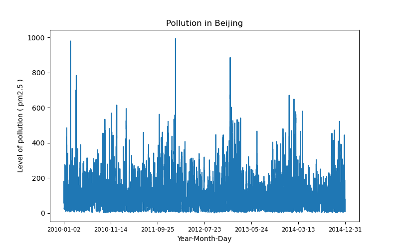
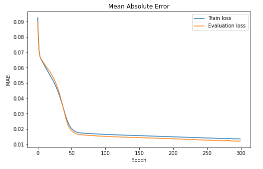
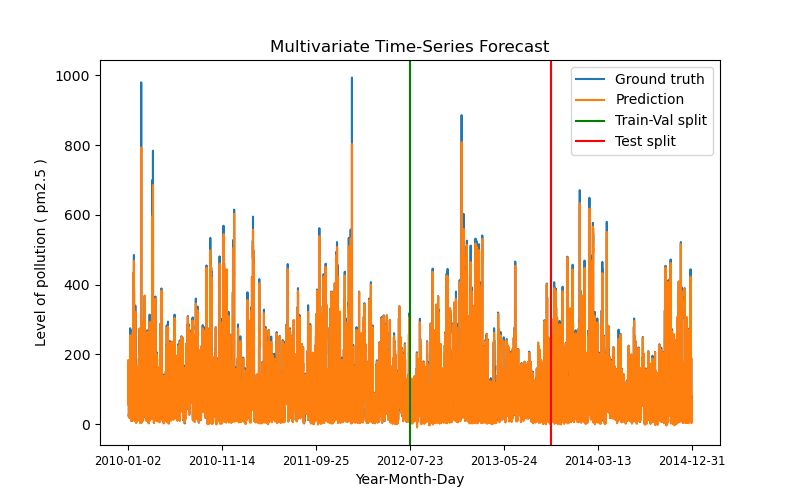

# Multivariate Time Series Forecasting of Level of pollution in Beijing

## Project description
The goal of the project was forecasting the next hour's level of pollution (pm2.5) in Beijing by using information about the level of pollution in the previous days.

## Dataset 
The dataset is stored as a **csv** file [pollution.csv](src/data/) downloaded from [Datasets repository](https://github.com/jbrownlee/Datasets) provided by [jbrownlee](https://github.com/jbrownlee). Dataset consists of hourly data from 02. January 2010. up to 31. December 2014. It contains 41757 hours of measurements.

### Visualization of the dataset



### Data preprocessing

The dataset consists of several features:
1. No: Row number
2. year: year of measurement
3. month: month of measurement
4. day: day of measurement
5. hour: hour of measurement
6. pm2.5: PM2.5 concentration, this is the level of pollution we are trying to estimate
7. DEWP: Dew Point
8. TEMP: Temperature
9. PRES: Pressure
10. cbwd: Combined wind direction
11. Iws: Cumulated wind speed
12. Is: Cumulated hours of snow
13. Ir: Cumulated hours of rain

Features related to date: year, month, day & hour were joined in the YYYY-MM-DD-HH:HH:HH format into a single feature: 'Date'. Combined wind direction feature ('cbwd') is a categorical variable so values of that feature were transformed into integers using [sklearn's label encoder](https://scikit-learn.org/stable/modules/generated/sklearn.preprocessing.LabelEncoder.html). The row number ('No') feature was dropped. 

Every feature, except for date was time-lagged for two time steps (two hours). So along with that we constructed input-output pairs which contain:


1. input - 16 variables: 8 variables time lagged for one and two hours (including pm2.5)
2. output - pm2.5 (t) which is the target value which we are trying to predict. 

Default value of time lag(length of each input example) is two as previously mentioned but it can be modified in the **lag** argument of the *ArgumentParser* object in the [globals.py](src/globals.py) file. With this approach (and these hyperparameters) we created a dataset with 41755 input-output pairs.

### Train-Validation-Test split
Previously created subsequences were split into train, validation and test set with 0.5-0.25-0.25 split ratios. This split ratios were chosen as a way to split the data in such way that first two years would end up in the training set, and the next two consecutive years were split into validation and test set evenly (one year each). This hyperparameters can be modified the same way as time lag, in the [globals.py](src/globals.py) file.

## Model
The model consists of a single layer LSTM and a fully connected layer. The hidden cells values of the last layer of LSTM are fed into a FC layer which has a linear activation.

**LSTM layer architecture:**
| Input dim.      | Embedding dim. | Number of layers |
| :-------------: | :-------------: | :-------: |
|     8      | 6       | 1       |

Input dimension of the LSTM is 8 because the shape of the input for an LSTM is (batch_size, sequence_length, input_dim). Considering we are taking last two hours into account when predicting pm2.5 concentration in the next hour, we have input shape in the next form: (bath_size, lag=2, number_of_features=8).

## Training
The model was trained for **300 epochs** using Google Colab. 
**Adam optimizer** was used with **learning rate of 2e-4** and a slight **L2 regularization**. The batch size contained **512** examples.
Along with that **Mean Absolute Error (L1 loss)** function was used. In the training process it showed better results (regarding the convergence) than the Mean Squared Error. Most of the previously mentioned hyperparameters can be modified in the [globals.py](src/globals.py) file.


### Loss
On the image bellow we can see train and test losses (MAE) during training. Performance evaluation on the validation was performed in a single batch manner.



## <a name="eval_res"></a> Evaluation Results
On the image below we can see the evaluation on the entire dataset. 



The model is succesfull in estimating the position of the peaks, but has difficulty in estimating the exact values of the sequence. With respect to that bellow we can see a table with final evaluation metrics.


| Train MAE. | Validation MAE. | Test MAE. |
| :-------------: | :-------------: | :-------------: |
| 14.2131  | 12.8441  | 12.3864 |


## Setup & instructions
1. Open Anaconda Prompt and navigate to the directory of this repo by using: ```cd PATH_TO_THIS_REPO ```
2. Execute ``` conda env create -f environment.yml ``` This will set up an environment with all necessary dependencies. 
3. Activate previously created environment by executing: ``` conda activate pollution-forecast ```
4. Training and/or testing the model.

    a) If you want to train the model you should execute: ``` python src/main.py --mode train ```. This will load and prepare the dataset and start training it with default values of the hyperparameters which can be found in the [globals.py](src/globals.py) file. You can change them directly in the script or via command line by for example executing: ``` python src/main.py --mode train --lr 3e-2``` This will start the script in the train mode with learning rate set to 3e-2. The model will then be evaluated on the entire set.
    
    b) If you don't want to train the model you can use model pretrained by me by executing: ``` python src/main.py ``` which will automatically load and prepare the dataset, instantiate the model, load the pretrained model and evaluate it as demonstrated above in [Evaluation results](#eval_res). Mode argument has default value of "eval" so running former code is same as explicitly saying ``` python src/main.py --mode eval```. If you use any of these two approaches you can set other arguments as well, but most of them will be ignored considering we are not training the RNN, we are just evaluating it. Split ratio is the only argument which would have effect, but only when evaluating test set MAE.
    
